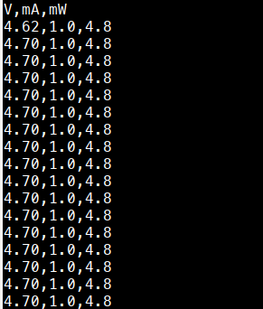

# Micropython INA219 High Side Current Sensor Library with ESP32 Bluetooth BLE App



This repo contains an Bluetooth BLE app for reading from a INA219 I2C 
high-side current sensor using Micropython on a ESP32.  The app uses 
the nRF UART BLE serivce to send over BLE its readings.

These reading are also printed to the terminal so if you don't want to 
use bluetooth BLE you can connect to the ESP32 console instead.

This repo also contains a Libary for reading the bus and shunt
voltage and currents from a ina219 chip using Micropython.

### Simple Example

A simple example for reading the INA219 library.

```python
from machine import I2C
from ina219 import INA219
i2c = I2C(1)
ina = INA219(i2c, rshunt=.1)
print(d.current(), d.shunt_voltage() / rshunt)
```

The class INA219 takes the following arguments                 

```python
INA219(i2c, 
       rshunt=0.1,   # shunt resistance measured across by the INA219
       maxvolts=16,  # the max volts you expect at IN-
       maxamps=.1,   # the max amps you expect through the sensor
       BADC=15,      # average 128 12bit samples to get bus voltage
       SADC=15,      # average 128 12bit supply to get shunt voltage
       MODE=7,       # set sampling to shunt and bus continuous mode
       addr=0x40     # default i2c address for the INA219
      )
```

1. "maxvolts" sets the BRNG register for different VBUS ranges, namely
16V and 32V.  BRNG is set to the minimum voltage that maxvolts fits under.
2. "maxamps" set the PG register for different VSHUNT ranges,
namely .04V, .08V, .16V, and 0.32V.  PG is set to the minimum
voltage that (maxamps * rshunt) fits under.
3. The BADC, SADC, and MODE variables are set according to the tables in 
the INA219 datasheet.
4. Internally the library sets the INA219 calibration value
to 0xFFFE for maximum precision when measuring current and power draw.

### The BLE/Console App

Copy blueshunt.py to your ESP32 as main.py and it should
run after reset.  The BLE UART service will show up as "blueshunt".  The 
same values sent (or "notified") over BLE are also printed to the 
Micropython console.

